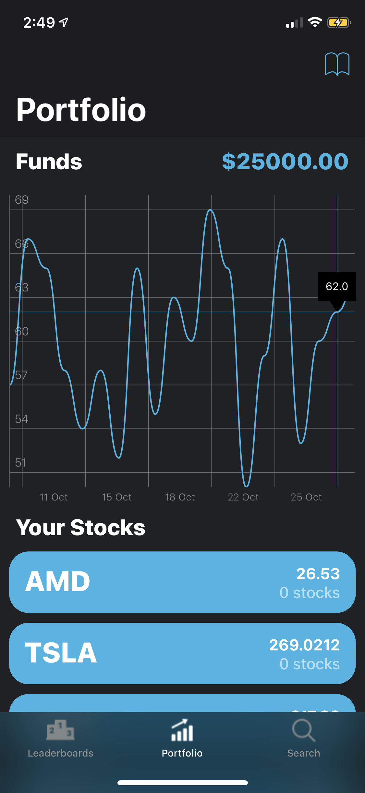
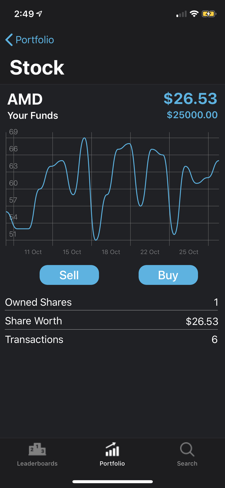
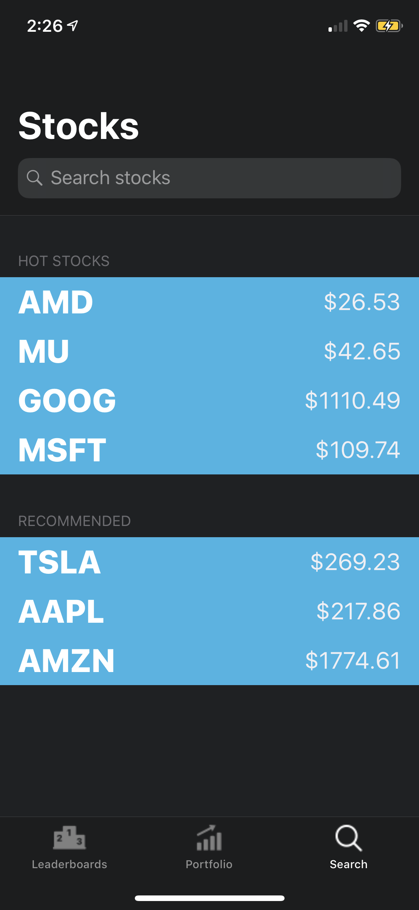
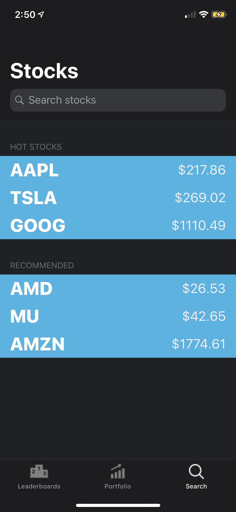

# Investa
## Learn how to work the Stock Market without actually losing all of your money
Project for [HackGT 2018](hack.gt), a 36 hour Hackathon at Georgia Institute of Technology with over a thousand participants.

### Developers

* [Cameron Bennett](https://github.com/mach33n)
* [Tillson Galloway](https://github.com/tillson)
* [Nicholas Grana](https://github.com/Nicholas714)
* [Max Harley](https://github.com/t94j0)

### Screenshots

